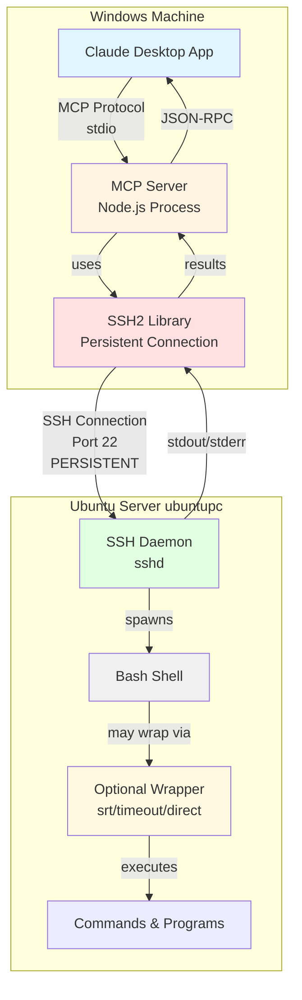

# Generic SSH MCP

A flexible MCP server for executing commands on remote servers via SSH with optional command wrappers.

## Features

- **Persistent SSH Connection**: Fast command execution using ssh2 library
- **Configurable Wrapper**: Optional command wrapper for sandboxing, timeouts, or other control
- **Configurable Tool Name**: Custom tool name per instance for easy identification in Claude UI
- **Multiple Systems**: Build separate packages for different target systems
- **Simple Tool Interface**: Single tool with string parameter

## Quick Start

### 1. Build for your target system

```bash
./build.sh ssh-ubuntupc
```

This creates `ssh-ubuntupc.mcpb` which you can install in Claude Desktop. The tool will appear as "ssh-ubuntupc" in the Claude UI.

### 2. Install in Claude Desktop

1. Transfer the `.mcpb` file to Windows
2. Double-click to install
3. Configure:
   - **SSH Host**: `192.168.1.70` (use IP address, not hostname)
   - **SSH Username**: `YourUsername`
   - **SSH Private Key Path**: `C:\Users\YourUsername\.ssh\id_ed25519`
   - **Command Timeout**: `30` (seconds)
   - **Command Wrapper**: leave empty for direct execution, or `srt` for sandboxing
   - **Tool Name**: `ssh-ubuntupc` (auto-populated, helps distinguish multiple SSH servers)

### 3. Use in Claude

```
Using ssh-ubuntupc, run: ls -la /home/YourUsername
```

## Tool Name Configuration

When running multiple SSH MCP servers (e.g., one for each remote system), the tool name helps distinguish them in the Claude UI.

The build script automatically sets the tool name to match the package name:

```bash
./build.sh ssh-kali      # Tool appears as "ssh-kali" in Claude UI
./build.sh ssh-ubuntupc  # Tool appears as "ssh-ubuntupc" in Claude UI
```

Without this, all instances would show as "command" making them indistinguishable.

## Command Wrapper

The wrapper field allows you to control how commands execute:

**No wrapper (empty string):**
- Commands execute directly via bash
- Fast, unrestricted
- Use for trusted environments

**With `srt` wrapper:**
- Commands sandboxed with kernel-level restrictions
- Requires SRT installed on remote system
- Filesystem and network policy enforcement
- See INSTALLATION.md for SRT setup

**With `timeout N` wrapper:**
- Commands limited to N seconds
- Automatic termination on timeout
- Useful for potentially long-running commands

**With `nice -n N` wrapper:**
- Commands run at lower priority
- Less impact on system load

**Custom wrappers:**
- Any command that accepts a command string
- Example: `strace -e trace=file` for debugging

> [!WARNING]
> **Command Wrapper Configuration**: For direct bash execution, leave the wrapper field empty or use a single space `" "`. Never use `"bash"` as the wrapper - this creates a double bash invocation (wrapper bash + SSH daemon bash) causing command failures.

## Multiple Systems

Build a package for each system you want to connect to:

```bash
./build.sh ssh-ubuntupc    # Creates ssh-ubuntupc.mcpb
./build.sh ssh-kali        # Creates ssh-kali.mcpb
./build.sh ssh-pihole      # Creates ssh-pihole.mcpb  
./build.sh ssh-prodserver  # Creates ssh-prodserver.mcpb
```

Each package is independent with its own configuration in Claude Desktop. Each will display with its own name in the Claude UI for easy identification.

## Architecture



```
Claude Desktop (Windows)
  → MCP Server (Node.js on Windows)
    → SSH2 library
      → SSH connection to remote server
        → [Optional wrapper command]
          → Actual command execution
```

**Example with SRT wrapper:**

```
User asks: "list files"
  → Tool call: command(command="ls -la")
    → Server wraps: srt 'ls -la'
      → SSH executes on remote: srt 'ls -la'
        → SRT applies policy, spawns bubblewrap
          → Sandboxed bash executes: ls -la
```

## Tool Definition

**Name:** Configurable via `tool_name` parameter (defaults to package name)

**Parameters:**
- `command` (string, required): The command to execute

**Behavior:**
- Checks for interactive commands (rejects vim, top, sudo without args, etc.)
- Applies wrapper if configured
- Executes via persistent SSH connection
- Returns stdout, stderr, and exit code

## Files

- `manifest.json` - MCP package definition
- `server/index.js` - MCP server implementation  
- `package.json` - Node.js dependencies
- `build.sh` - Build script for creating named packages
- `INSTALLATION.md` - Detailed setup guide (SRT-focused)
- `COMPARISON.md` - Standard vs SRT comparison
- `QUICKSTART.md` - 5-minute setup

## Security with SRT

When using the `srt` wrapper:

1. Install prerequisites on remote system:
```bash
sudo apt install bubblewrap
sudo chmod u+s /usr/bin/bwrap
npm install -g @anthropic-ai/sandbox-runtime
```

2. Create policy file (`~/.srt-settings.json`):
```json
{
  "filesystem": {
    "denyRead": ["~/.ssh/id_rsa", "~/.ssh/id_ed25519", "~/.srt-settings.json"],
    "allowWrite": ["~/projects", "/tmp"],
    "denyWrite": ["/etc", "/usr", "~/.ssh", "~/.srt-settings.json"]
  },
  "network": {
    "allowedDomains": ["github.com", "pypi.org"],
    "deniedDomains": []
  }
}
```

3. Test SRT:
```bash
srt 'ls -la'                    # Should work
srt 'cat ~/.ssh/id_ed25519'     # Should be blocked
```

### ⚠️ Critical SRT Security Warning

**Default SRT configuration has a security vulnerability**: SRT does not block access to its own config file by default. Without proper configuration, Claude can modify `~/.srt-settings.json` to escape the sandbox.

**Required protection**:
```json
{
  "filesystem": {
    "denyRead": ["~/.srt-settings.json"],
    "denyWrite": ["~/.srt-settings.json"]
  }
}
```

**Verification test**:
```bash
# This should be BLOCKED
srt 'cat ~/.srt-settings.json'
srt 'echo "malicious" >> ~/.srt-settings.json'
```

If these commands succeed, your sandbox is compromised. SRT must deny both read and write access to its own configuration file to prevent escape.

**Reference**: See [Anthropic Sandbox Runtime](https://github.com/anthropic-experimental/sandbox-runtime) for more details on SRT configuration and security considerations.

See INSTALLATION.md for complete setup instructions.

## Version History

- **3.1.0** - Configurable tool name
  - Added `--tool-name` parameter for custom tool names in Claude UI
  - Build script auto-sets tool name to match package name
  - Helps distinguish multiple SSH server instances
  
- **3.0.0** - Generic SSH with configurable wrapper
  - Tool renamed from `bash` to `command`
  - Added configurable wrapper field
  - Build script for creating multiple named packages
  
- **2.1.0** - SRT-specific version (deprecated)
  - Hardcoded SRT wrapper
  
- **2.0.0** - Persistent SSH2 connection
  - Original ubuntu-shell-mcp with SSH2

## License

MIT License

## Author

Carlos - BlockSecCA
